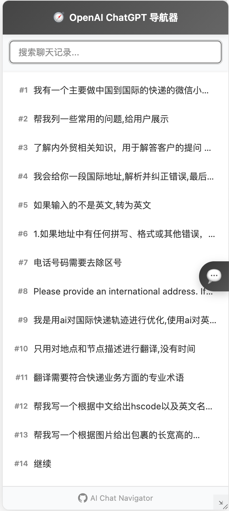
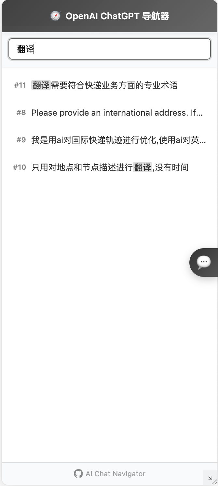

# AI Chat Navigator

<p align="center">
  
</p>

<p align="center">
  <b>智能聊天助手侧边栏，轻松浏览、搜索和管理 GitHub Copilot 和 ChatGPT 的对话历史记录</b>
</p>

<p align="center">
  <a href="#功能特点">功能特点</a> •
  <a href="#截图预览">截图预览</a> •
  <a href="#安装方法">安装方法</a> •
  <a href="#使用说明">使用说明</a> •
  <a href="#支持的平台">支持的平台</a> •
  <a href="#常见问题">常见问题</a> •
  <a href="#隐私声明">隐私声明</a> •
  <a href="#贡献指南">贡献指南</a> •
</p>

## 功能特点

AI Chat Navigator 是一款专为 GitHub Copilot 和 OpenAI ChatGPT 用户设计的浏览器扩展，它能帮助您更高效地管理和利用AI对话内容：

- **📜 历史记录导航**：在侧边栏查看和浏览当前会话的所有消息历史
- **🔍 强大的搜索功能**：快速搜索您的对话内容，关键词高亮显示
- **📌 消息定位**：点击任意历史消息，自动跳转并高亮原始位置
- **🪟 可调整窗口**：自由拖动、调整大小，或最小化侧边栏
- **📱 响应式设计**：自适应不同屏幕尺寸，确保良好的用户体验
- **🌓 暗黑模式支持**：自动适配系统明暗主题设置
- **🔄 实时同步**：当您与AI对话时，历史记录自动更新
- **⌨️ 键盘快捷键**：支持Ctrl+F快速搜索等常用操作

## 截图预览

### 搜索功能

<p align="center">
  
  
</p>
## 安装方法

### 手动安装（开发版）

1. [下载最新版本](https://github.com/huajia2005/ai-chat-navigator/releases)并解压
2. 在Chrome/Edge浏览器中访问 `chrome://extensions`
3. 开启右上角"开发者模式"
4. 点击"加载已解压的扩展程序"
5. 选择解压后的文件夹

## 使用说明

1. 安装扩展后，访问 [GitHub Copilot](https://github.com/copilot) 或 [ChatGPT](https://chat.openai.com/)
2. 在页面右侧会出现一个导航按钮
3. 点击按钮打开侧边栏，查看当前会话的聊天历史
4. 在搜索框中输入关键词可以快速查找内容
5. 点击任意消息可立即定位到原始消息位置

### 快捷键

- **Ctrl+F** 或 **Cmd+F**（在侧边栏内）：聚焦到搜索框
- **Esc**（在搜索框内）：清除搜索内容并退出搜索

## 支持的平台

目前支持以下AI聊天平台：

- [GitHub Copilot](https://github.com/copilot) (`github.com/copilot/c/*`)
- [OpenAI ChatGPT](https://chat.openai.com/) (`chatgpt.com/*`)
- [Anthropic Claude](https://claude.ai/) (`claude.ai/*`)
- [Google Gemini](https://gemini.google.com/) (`gemini.google.com/*`)
- [Grok](https://grok.com) (`grok.x.ai/*`)

我们计划未来添加对更多AI助手平台的支持。

## 常见问题

### 为什么侧边栏中看不到任何消息？

确保您已经在当前会话中与AI进行了对话。对于新会话或初次加载的页面，可能需要等待一段时间让扩展检测到对话内容。

### 侧边栏是否会保存我的聊天记录？

AI Chat Navigator 不会存储或发送您的聊天内容到任何远程服务器。它只是提供一个当前会话的导航工具，一旦关闭或刷新页面，侧边栏中的内容将被清除。

### 如何调整侧边栏大小？

您可以通过拖动侧边栏右下角的调整手柄来改变窗口大小。您也可以通过拖动顶部区域来重新定位侧边栏。

### 扩展不能正常工作怎么办？

- 确保您使用的是最新版本的浏览器和扩展
- 尝试刷新页面或重新安装扩展
- 检查您访问的网站是否在支持列表中
- 如问题持续，请[提交问题报告](https://github.com/huajia2005/ai-chat-navigator/issues)

## 隐私声明

AI Chat Navigator 尊重您的隐私：

- 不收集或传输任何聊天内容或个人数据
- 不要求任何多余的权限
- 不使用任何跟踪或分析代码
- 所有功能完全在本地运行

## 贡献指南

我们欢迎社区贡献！如果您想参与改进 AI Chat Navigator：

1. Fork 本仓库
2. 创建您的特性分支 (`git checkout -b feature/amazing-feature`)
3. 提交您的更改 (`git commit -m 'Add some amazing feature'`)
4. 推送到分支 (`git push origin feature/amazing-feature`)
5. 开启一个 Pull Request

### 开发环境设置

```bash
# 克隆仓库
git clone https://github.com/huajia2005/ai-chat-navigator.git

# 进入目录
cd ai-chat-navigator

# 在浏览器中加载扩展进行测试
# Chrome: 访问 chrome://extensions/
# Edge: 访问 edge://extensions/
# 开启"开发者模式"并选择"加载已解压的扩展程序"
